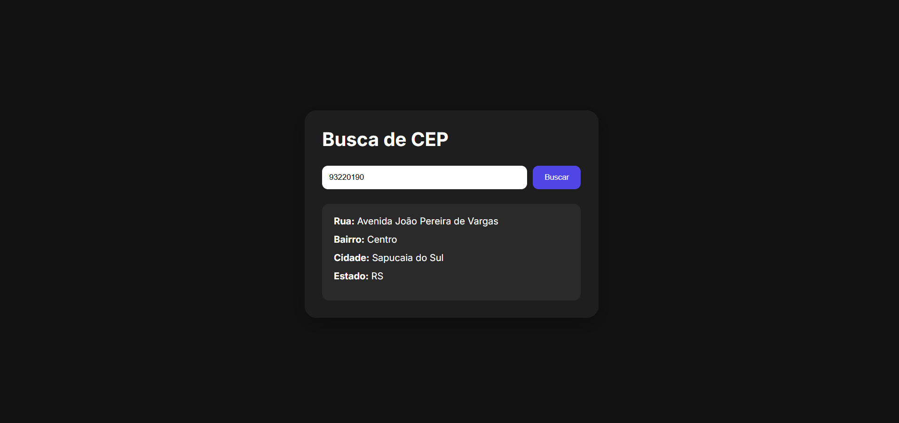

# Busca CEP

Aplicação web para consulta de endereços a partir de um CEP, desenvolvida como parte dos meus estudos de front-end.



---

## Sobre o projeto

O usuário digita um CEP e a aplicação consulta a API pública [ViaCEP](https://viacep.com.br/), exibindo os dados de endereço correspondentes: rua, bairro, cidade e estado.

---

## Funcionalidades

- Busca de endereço por CEP via API REST
- Exibição dos dados: logradouro, bairro, cidade e UF
- Feedback de erro quando o CEP não é encontrado
- Layout responsivo com tema escuro

---

## Tecnologias utilizadas

- HTML5
- CSS3 (variáveis CSS, Flexbox, responsividade)
- JavaScript (Fetch API, async/await)
- [ViaCEP API](https://viacep.com.br/) — API pública e gratuita para consulta de CEPs brasileiros
- [Google Fonts — Inter](https://fonts.google.com/specimen/Inter)

---

## Estrutura do projeto

```
busca-cep/
├── index.html
├── css/
│   └── style.css
├── js/
│   └── script.js
└── images/
    └── desktop-buscacep.png
```

---

## Como usar

1. Clone o repositório:

   ```bash
   git clone https://github.com/seu-usuario/busca-cep.git
   ```

2. Abra o arquivo `index.html` no navegador.

3. Digite um CEP válido (ex: `01310-100`) e clique em **Buscar**.

> Nenhuma instalação ou dependência necessária. O projeto roda diretamente no navegador.

---

## Conceitos praticados

- Consumo de API externa com `fetch` e `async/await`
- Manipulação do DOM com JavaScript puro
- Uso de variáveis CSS (`--accent-color`, `--bg-color`, etc.)
- Responsividade com media queries
- Organização de projeto front-end (HTML + CSS + JS separados)

---

## Aprendizados

Este projeto foi desenvolvido durante minha jornada de estudos front-end. O principal desafio foi entender o fluxo assíncrono do `fetch` — como aguardar a resposta da API antes de atualizar a interface, e como tratar o caso em que o CEP não existe (`data.erro`).

---

## Autor

**Vinicius Silveira**
Estudante de Análise e Desenvolvimento de Sistemas  
[GitHub](https://github.com/vinidsilveira) · [LinkedIn](https://www.linkedin.com/in/vinicius-silveira-dev/)
